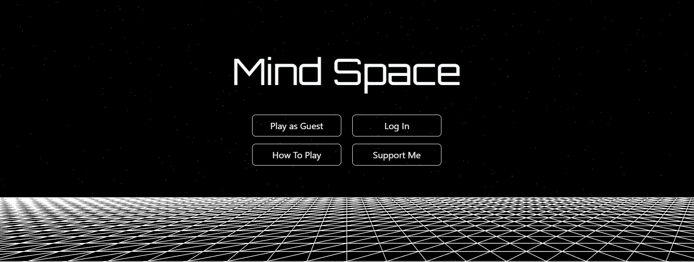
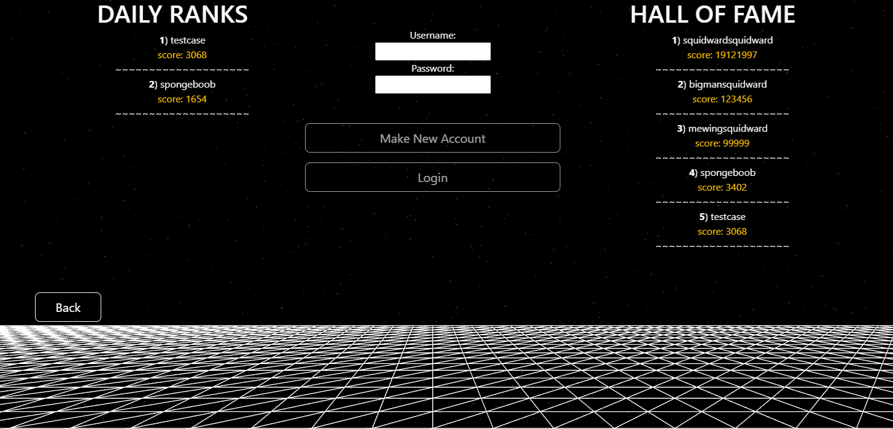
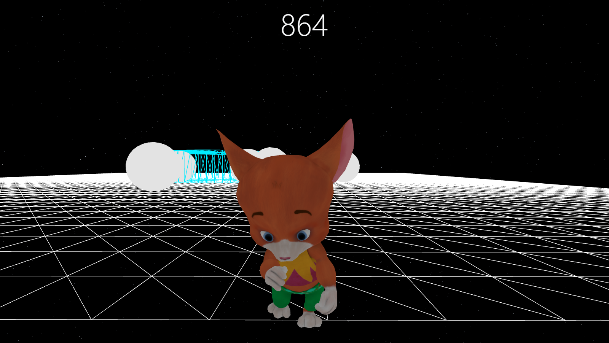
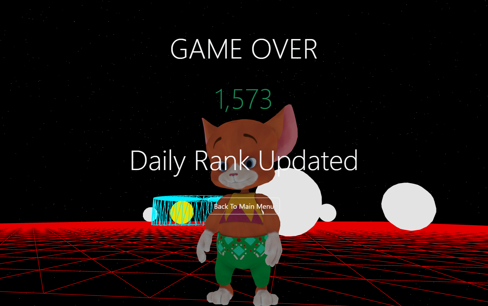

# What is this?
"Mind Space" was a milestone project submission for a 6-months professional diploma bootcamp by NUS-ISS Singapore. It is a simple 3D game meant for desktop/laptop, with full CRUD functionality and built with full stack technologies. It comes with a "hall of fame" that tracks all time high scores, a "daily ranks" that tracks high scores of the day and expires at 0000 SGT, and a simple vulgarities filter used during account creation. It took 3 weeks to build the proof of concept + 2 days of bug fixing and polish to get it to the state it is in.

You can try it here at: [Mind-Space](https://mind-space.up.railway.app/)

# How it looks like (✨🔊It has sound🔊✨)

# Technologies used
              

### Why Threejs with Angular (instead of React)?
Ans: It was a project requirement to use Angular, Threejs was the hole I chose to jump into

# Where it can be improved
1. The structure of the threejs code is a war crime. (the rest I am somewhat proud of)

2. The timer/score only updates on user interaction (touched/dirty)
    - Have tried using angular signals
    - Have tried using rxjs to make the timer a subject and subscribing to it
    - changedetectorref to manually trigger change detection (however wasn't possible as my game code is the angular service instead of a component)

    I suspect this is due to change detection but I cannot think of what else to try without warranting a rewrite of the entire game logic

3. Implementing a spinner for certain loading/async calls to external apis (e.g. the loading of scores in the login view and the game end state message)

4. Implementing a translucent/opaque background for certain areas (so that the words displayed are more visible in the 3D space)

5. Camera view on repeat plays
    - On repeat plays the view is stuck to the last 3D view it had
    - Have tried to reset the camera (both the position and the direction it is looking at) but it has had little effect
    - A proper fix may require resetting not just the camera but also the player physics and visual mesh (as the camera follows the player)

6. (bug) Repeat visits from user WILL wrongly load the outdated cached version if there was an update to the frontend in between visits
    - User refreshing the browser would correctly load the new version and 'fix' it
    - This might be a common behavior for Angular projects, the manga site I was reading on had the same cache behavior
    - After doing some light googling it would seem to suggest that the culprit is the caching of the index html

# Why did I not delete the 'unprofessional comments'?
(Unprofessional in the sense that some comments did not have any functional purpose)

Ans: For nostalgia in the future and it's kinda funny. (importantly it wasn't for work or in a professional setting)

# How to use it (if it is no longer being hosted)
The main 'game' is built using Threejs and Cannon-es physics engine and bundled into the static assets of the spring boot backend.

1) Create SQL DB (there was a requirement for 1-to-1 and 1-to-many hence this structure) <pre>
    CREATE DATABASE IF NOT EXISTS mindspace_sql_db;
    USE mindspace_sql_db;

    CREATE TABLE IF NOT EXISTS username_password (
        username varchar(32) NOT NULL,
        password varchar(32) NOT NULL,
        PRIMARY KEY (username)
    );

    CREATE TABLE IF NOT EXISTS personal_score (
        username varchar(32) NOT NULL,
        score int NOT NULL,
        PRIMARY KEY (username),
        CONSTRAINT fk_personal_score_username FOREIGN KEY (username) REFERENCES username_password(username)
    );

    CREATE TABLE IF NOT EXISTS hall_of_fame (
        username varchar(32) NOT NULL,
        score int NOT NULL,
        score_id int AUTO_INCREMENT,
        PRIMARY KEY (score_id),
        CONSTRAINT fk_hall_of_fame_username FOREIGN KEY (username) REFERENCES username_password(username)
    );</pre>
2) Create Redis DB

3) Link it to the project via the backend application properties 
\> Mind-Space-Backend\src\main\resources\application.properties 
\> Note to fill in/match all ${} environment variables

4) Run commands in terminal (runs the project in dev mode) 
\> ng serve --proxy-config proxy.config.json (run this in the frontend folder) 
\> mvn spring-boot:run (run this in the backend folder)

(optional) 
Un-comment the code for the physics cannon debugger to see the mesh of the physics bodies 
\>  Mind-Space-Frontend\src\app\services\mind-space.service.ts 

# Credits
\- Model and animations from [Mixamo](https://www.mixamo.com/) 
\- Music and sound from [Pixabay](https://pixabay.com/) 
\- My awesome coursemates for being my inspiration to try achieve better
